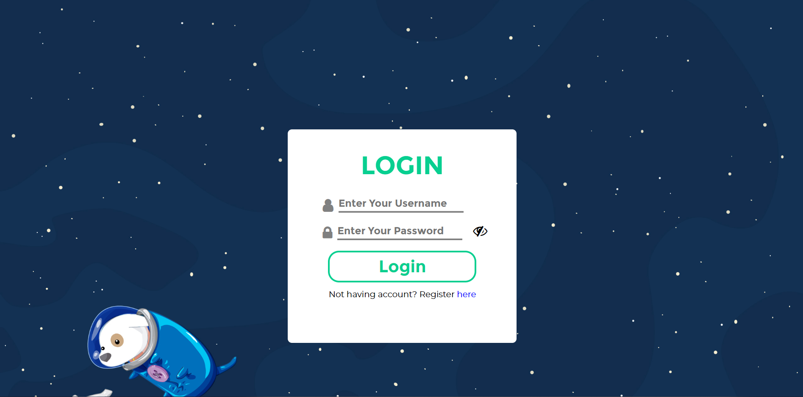
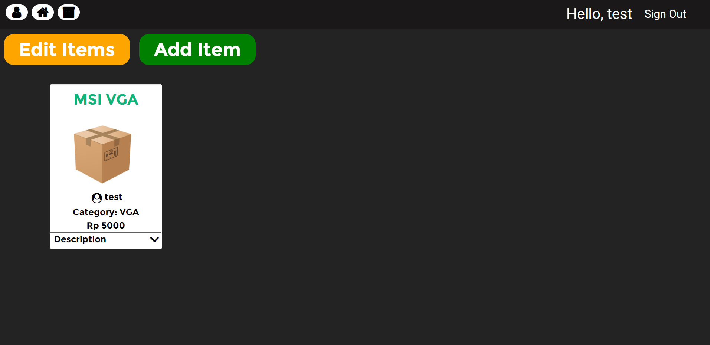
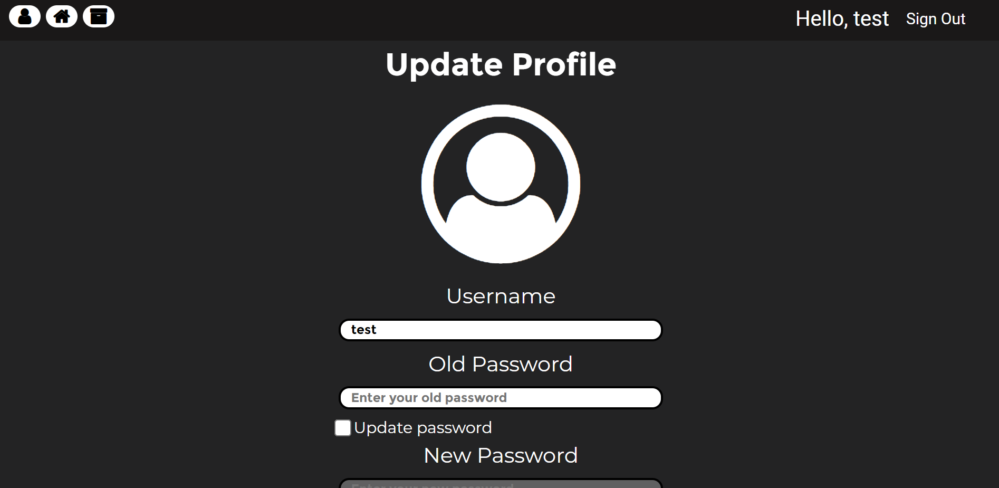

# Find Computer

A web based project for Software Engineering Academy assignment. The website can be accessed in [here](http://54.255.226.109/login)

## Preview

### Login Page

### Item Page

### Update Profile Page

## Tech Stack

This application is built using:

- Spring Boot 2.3.1
- React 16.13.1
- Nginx 1.19.1
- Docker 19.03.1
- AWS EC2
- AWS RDS

## Feature in This Application

- Register
- Login
- CRUD Items
- Change Profile
- Search for Items By Category and User
- Buy Other User Items

About API documentation can be found [here](https://github.com/WilliamChang80/SEA-BE)
